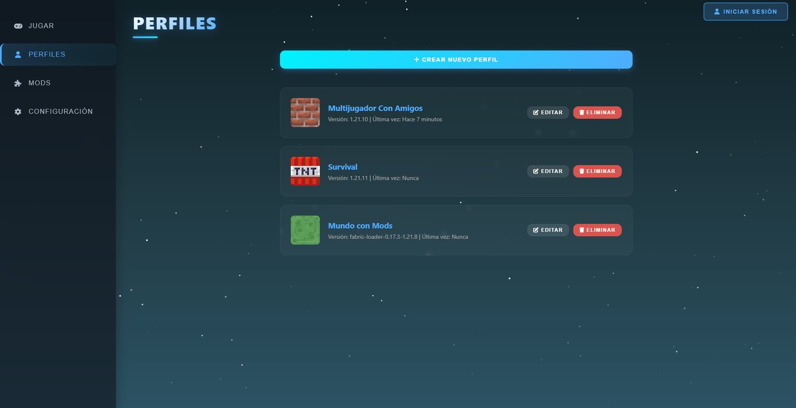
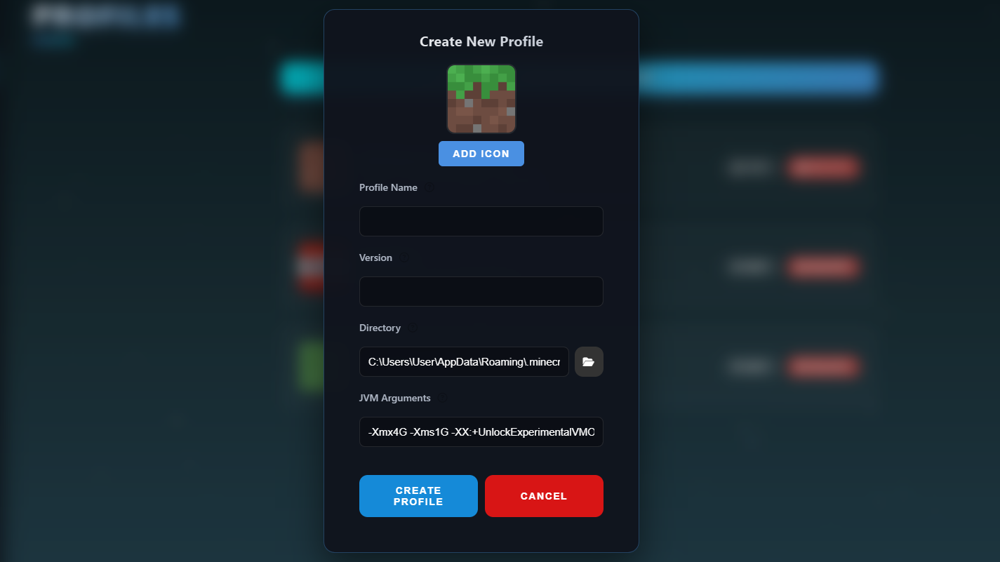
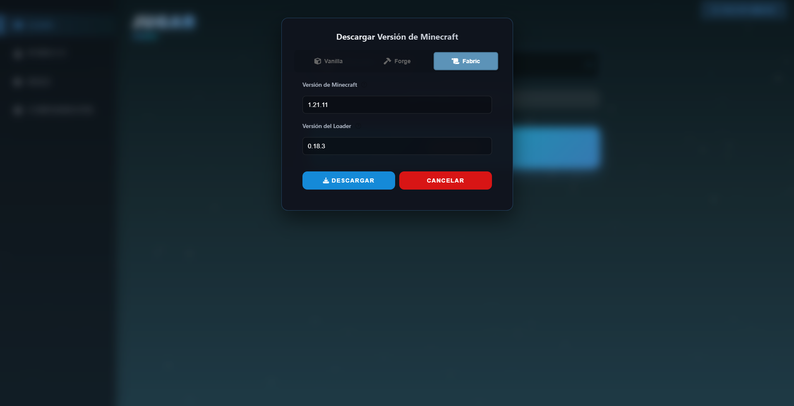
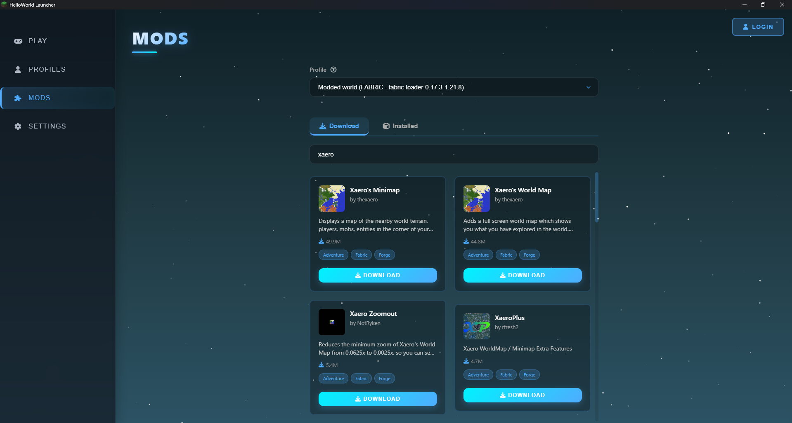
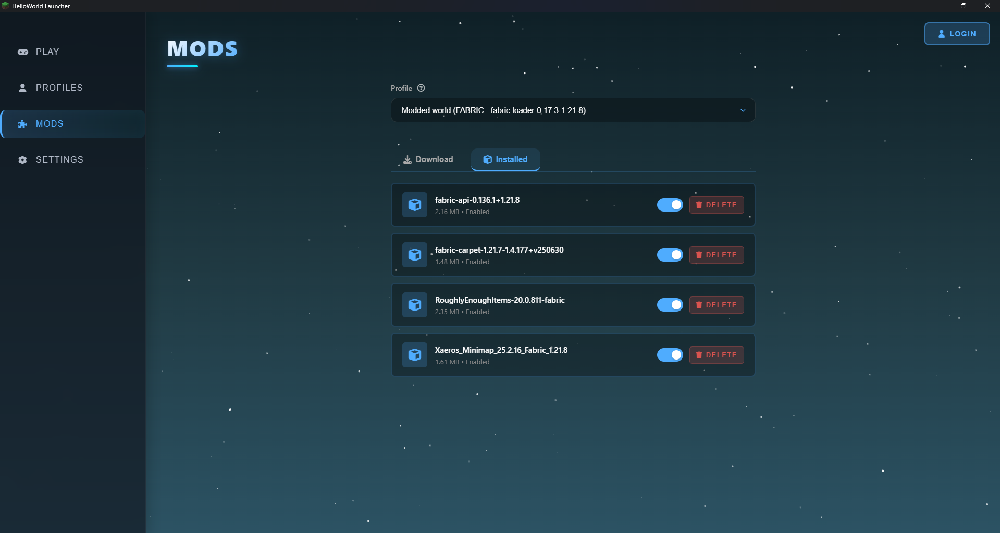

# HelloWorld Launcher

HelloWorld Launcher is a launcher for Minecraft: Java Edition. It is open source, completely free, and virus-free. It has features that other launchers do not have, such as mod installation, profile customization, and even the ability to open more than one game instance at a time.

## Comparison with other launchers
| | HelloWorld | Official Launcher | TLauncher |
|---|---|---|---|
| Mod Installation | ✅ | ❌ | ✅ |
| Execution Speed | ~7 s | ~35 s | ~55 s |
| RAM Usage | Low | Medium | High |
| Security | High | Very High | ... |
| Offline Mode | Yes | Yes | No |
| No Telemetry | Yes | No | No |
| Program Size | Lightweight | Heavy | Heavy |
| JVM Customization | High | Low | Medium |
| Performance on Low-end PCs | Very Good | Decent | Normal |
| Microsoft Account Mandatory | No | Yes | No |
| Advanced Profile Management | Yes | Limited | Low |

---

### Minimum System Requirements
- Windows 32bit
- Java 17
- 1 GB RAM
- 100 MB free space

### Recommended System Requirements
- Windows 64bit
- Java 17
- 6 GB RAM
- 2 GB free space

---

### Screenshots

*Main Play Screen*

*Profile Management*

*Creating a New Profile*

*Downloading Minecraft Versions*

*Mod Search and Download*

*Installed Mods Management*

---

## Installation

1. Download the latest version from the **Releases** section.
2. Make sure you have **Java 17+** installed.
3. Run the launcher file.
> IF A VIRUS WARNING APPEARS, DON'T WORRY, IT IS BECAUSE THE APP IS NOT SIGNED, AS IT COSTS MONEY.
4. Log in or use offline mode.

> No additional programs are installed and the system is not modified.

---

## Quick Start

* **Install Version:** Vanilla, Forge, or Fabric versions.
* **Log In:** Log in with your Microsoft account or use offline mode.
* **Create Profile:** Customize the game directory and version.
* **Mods:** Add, remove, or disable mods per profile.
* **JVM:** Adjust RAM, arguments, and Java version.
* **Multiple Instances:** Open multiple games at once.

---

## Key Features

* **Privacy First:** No telemetry or trackers.
* **Fast Startup:** Optimized to open in seconds.
* **Integrated Mod Management:** No external tools needed.
* **Smart Profiles:** Each world with its own configuration.
* **Lightweight:** Ideal for old PCs or those with few resources.
* **Open Source:** Auditable and modifiable code.

---

## Security and Privacy

* Does not collect user data.
* Does not send information to external servers.
* Open source for full auditing.
* No hidden installers or added software.

---

## FAQ

**Why does it say the launcher has a virus?**
Because the app is not signed, as code signing certificates cost money.

**Is it legal?**
The launcher is legal. Using Minecraft utilizes a copy of the game in accordance with Mojang/Microsoft terms.

**Does it work with large mods?**
Yes, including heavy modpacks if your system allows it.

**Does it support Fabric and Forge?**
Yes, with independent profiles.

**Can I use it without Internet?**
Yes, via offline mode.

---

## Development

* Main Language: Python
* Compatible with Windows
* Modular architecture to easily add features

### Contributing

1. Fork the repository.
2. Create a branch with your improvement.
3. Submit a Pull Request.

Ideas and suggestions are welcome.

---

## Roadmap

* Automatic update system
* Mod downloading
* Interface improvements

---

## Support

If you find bugs or have suggestions, open an **Issue** on GitHub Issues.

