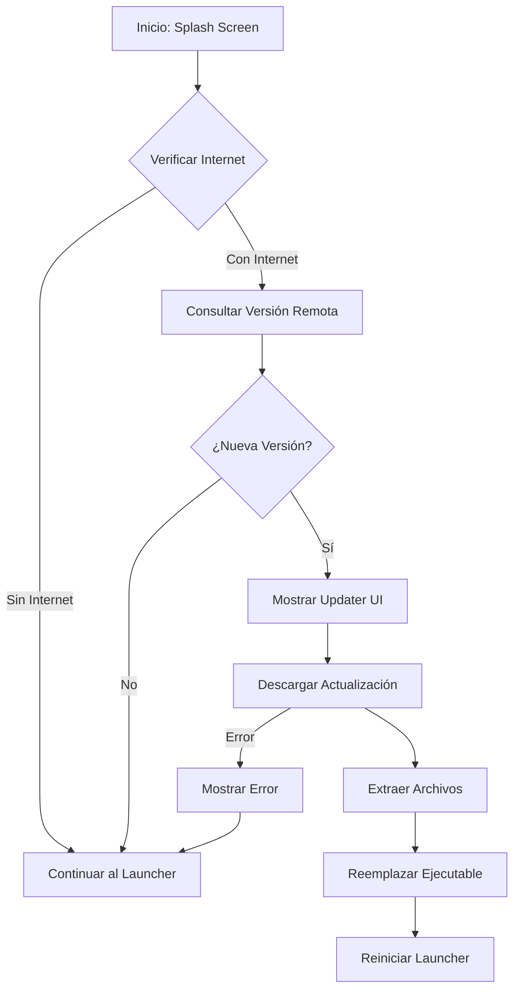

# Sistema de Actualización - HelloWorld Launcher

## Descripción General

El sistema de actualización se ejecutará **entre el splash screen y el launcher principal**, verificando si hay una nueva versión disponible antes de iniciar la aplicación. Si no hay conexión a internet, el actualizador se saltará automáticamente y continuará con el launcher.

## Diseño UI/UX

### Estados de la Interfaz

El actualizador tendrá una interfaz moderna con glassmorphism que mostrará diferentes estados:

````carousel

<!-- slide -->

<!-- slide -->

````

### Características de Diseño

- **Tema oscuro** consistente con el launcher (#1a1a2e → #16213e)
- **Glassmorphism** con blur y transparencias
- **Animaciones suaves** para transiciones entre estados
- **Indicadores de progreso** circulares y lineales
- **Colores**: Verde (#5cb85c) para éxito, Rojo suave para cancelar

## Sistema de Detección de Actualizaciones

### Cómo Funciona

1. **Verificación de Internet**
   - Intenta hacer ping a un endpoint confiable (ej: `https://api.github.com`)
   - Timeout de 3 segundos
   - Si falla → Continúa sin actualizar

2. **Consulta de Versión**
   - Endpoint: `https://api.github.com/repos/USUARIO/REPO/releases/latest`
   - Compara versión local vs. versión remota
   - Formato de versión: Semantic Versioning (v1.2.3)

3. **Archivo de Versión Local**
   ```json
   {
     "version": "1.2.3",
     "last_check": "2025-12-12T14:00:00Z"
   }
   ```
   - Ubicación: `launcher_dir/version.json`

### Flujo de Ejecución



## Cambios Propuestos

### [NEW] [updater_ui.html](file:///c:/Users/AbelSánchezBardon/Documents/HelloWorld-Launcher/ui/updater.html)
- Interfaz HTML/CSS para el actualizador
- Estados: checking, downloading, success, error, no-internet
- Animaciones CSS para transiciones suaves

### [NEW] [updater_styles.css](file:///c:/Users/AbelSánchezBardon/Documents/HelloWorld-Launcher/ui/updater_styles.css)
- Estilos específicos del actualizador
- Glassmorphism, animaciones, progress rings
- Responsive y centrado

### [MODIFY] [updater.py](file:///c:/Users/AbelSánchezBardon/Documents/HelloWorld-Launcher/updater.py)
- Reescribir completamente con pywebview
- Funciones:
  - `check_internet()` - Verifica conectividad
  - `get_local_version()` - Lee version.json
  - `get_remote_version()` - Consulta GitHub API
  - `download_update()` - Descarga con progreso
  - `apply_update()` - Extrae y reemplaza archivos
  - `show_updater_window()` - Muestra UI con pywebview

### [MODIFY] [main.py](file:///c:/Users/AbelSánchezBardon/Documents/HelloWorld-Launcher/main.py)
- Modificar flujo de inicio:
  1. Mostrar splash
  2. **Ejecutar updater** (nuevo)
  3. Cerrar splash
  4. Iniciar launcher principal

### [NEW] [version.json](file:///c:/Users/AbelSánchezBardon/Documents/HelloWorld-Launcher/version.json)
- Archivo de versión local
- Estructura:
  ```json
  {
    "version": "1.0.0",
    "last_check": null,
    "update_channel": "stable"
  }
  ```

---

## Detalles Técnicos

### Detección de Internet

```python
import requests

def check_internet(timeout=3):
    try:
        response = requests.get("https://api.github.com", timeout=timeout)
        return response.status_code == 200
    except:
        return False
```

### Consulta de Versión Remota

```python
def get_remote_version(repo_url):
    try:
        response = requests.get(
            f"{repo_url}/releases/latest",
            timeout=5
        )
        data = response.json()
        return data["tag_name"].lstrip("v")  # "v1.2.3" -> "1.2.3"
    except:
        return None
```

### Comparación de Versiones

```python
from packaging import version

def is_newer_version(remote, local):
    return version.parse(remote) > version.parse(local)
```

### Descarga con Progreso

```python
def download_update(url, callback):
    response = requests.get(url, stream=True)
    total_size = int(response.headers.get('content-length', 0))
    downloaded = 0
    
    with open("update.zip", "wb") as f:
        for chunk in response.iter_content(chunk_size=8192):
            f.write(chunk)
            downloaded += len(chunk)
            progress = (downloaded / total_size) * 100
            callback(progress, downloaded, total_size)
```

### Aplicar Actualización

```python
import zipfile
import shutil
import sys

def apply_update():
    # 1. Extraer archivos
    with zipfile.ZipFile("update.zip", "r") as zip_ref:
        zip_ref.extractall("temp_update")
    
    # 2. Crear script de actualización
    update_script = '''
    import time, shutil, os, subprocess
    time.sleep(2)  # Esperar cierre del launcher
    shutil.move("temp_update/launcher.exe", "launcher.exe")
    subprocess.Popen(["launcher.exe"])
    os.remove("update.zip")
    '''
    
    with open("apply_update.py", "w") as f:
        f.write(update_script)
    
    # 3. Ejecutar script y cerrar
    subprocess.Popen([sys.executable, "apply_update.py"])
    sys.exit(0)
```

---

## Integración con el Flujo Actual

### Modificación en main.py

```python
# Línea ~111 (después de start_splash_thread())
start_splash_thread()
time.sleep(0.1)

# NUEVO: Ejecutar updater
from updater import run_updater_check
update_available = run_updater_check()  # Retorna True si se aplicó actualización

if update_available:
    # El updater reiniciará el launcher, salir
    sys.exit(0)

# Continuar con el flujo normal...
```

### Función run_updater_check()

```python
def run_updater_check():
    """
    Verifica actualizaciones y las aplica si es necesario.
    Retorna True si se aplicó una actualización (requiere reinicio).
    """
    # 1. Verificar internet
    if not check_internet():
        print("Sin internet, saltando actualización")
        return False
    
    # 2. Obtener versiones
    local_ver = get_local_version()
    remote_ver = get_remote_version()
    
    if not remote_ver or not is_newer_version(remote_ver, local_ver):
        print("Ya estás en la última versión")
        return False
    
    # 3. Mostrar ventana de actualización
    show_updater_window(remote_ver)
    
    # 4. Descargar y aplicar
    download_update(callback=update_progress)
    apply_update()
    
    return True
```

---

## Manejo de Casos Edge

### Sin Internet
- **Comportamiento**: Continuar normalmente sin mostrar updater
- **Log**: "No internet connection, skipping update check"

### Error en Descarga
- **Comportamiento**: Mostrar mensaje de error, botón "Continuar de todos modos"
- **UI**: Estado de error con opción de reintentar o continuar

### Versión Corrupta
- **Comportamiento**: Validar hash SHA256 del archivo descargado
- **Fallback**: Si falla validación, eliminar descarga y continuar

### Usuario Cancela
- **Comportamiento**: Cerrar updater, continuar al launcher
- **Recordatorio**: Mostrar notificación en launcher sobre actualización disponible

---

## Configuración Requerida

### Variables de Entorno / Config

```python
# En main.py o config.py
UPDATE_CONFIG = {
    "repo_url": "https://api.github.com/repos/USUARIO/HelloWorld-Launcher",
    "check_interval": 86400,  # 24 horas en segundos
    "auto_update": True,
    "update_channel": "stable"  # stable, beta, dev
}
```

### Dependencias Adicionales

```
requests>=2.31.0
packaging>=23.0
```

---

## Verificación

### Pruebas Manuales

1. **Sin Internet**:
   - Desconectar internet
   - Iniciar launcher
   - Verificar que se salta el updater y continúa normalmente

2. **Con Actualización Disponible**:
   - Modificar `version.json` a una versión anterior (ej: "0.9.0")
   - Iniciar launcher
   - Verificar que muestra updater y descarga

3. **Sin Actualización**:
   - Asegurar `version.json` tiene la última versión
   - Iniciar launcher
   - Verificar que se salta el updater

4. **Cancelar Descarga**:
   - Durante descarga, hacer clic en "Cancelar"
   - Verificar que continúa al launcher sin actualizar

### Pruebas Automatizadas

```python
# test_updater.py
def test_check_internet():
    assert check_internet() in [True, False]

def test_version_comparison():
    assert is_newer_version("1.2.0", "1.1.0") == True
    assert is_newer_version("1.1.0", "1.2.0") == False
    assert is_newer_version("1.1.0", "1.1.0") == False
```

---

## Notas Adicionales

> [!IMPORTANT]
> El updater debe ser **no bloqueante** y **rápido**. Si la verificación tarda más de 5 segundos, continuar sin actualizar.

> [!WARNING]
> **Seguridad**: Siempre verificar el hash SHA256 del archivo descargado antes de ejecutarlo para prevenir ataques man-in-the-middle.

> [!TIP]
> Considera implementar **delta updates** en el futuro para descargar solo los archivos modificados, reduciendo el tamaño de descarga.
